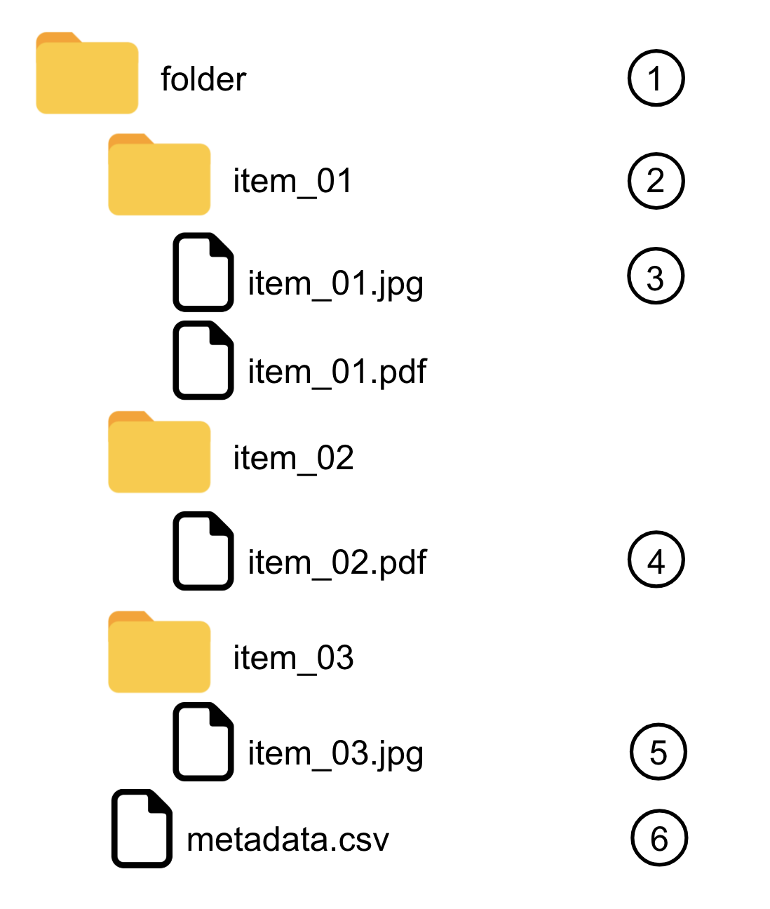

# iamassaccess

## Description
Upload and modify in mass for Internet Archive : 
- Upload several new items in Internet Archive with their metadata. Items are texts & images.
- Add or modify metadata to existing items.

## Installation
- `> git clone https://github.com/SciencesPoDRIS/iamassaccess.git`

- `> cd iamassaccess`

- `> mkvirtualenv iamassaccess`

- `> pip install -r requirements.txt`

- `> cp server/conf/conf.default.json server/conf/conf.json`

- Edit server/conf/conf.json to put your own access key which you get, once connected to Archive.org with your login from : 
http://archive.org/account/s3.php

## Execution
`> python iamassaccess_cli.py MODE [--metadata METADATA] [--folder FOLDER]`

- where "MODE" can be either *create* or *update*.

- where "METADATA" is the path to the metadata file

- where "FOLDER" is the path to the folder containing the items

- :exclamation: Caution :exclamation: : if you use MODE *update*, you don't have to use METADATA. The script will look for a file `metadata.csv` into your folder.

### Execution example
`> python iamassaccess_cli.py update --metadata test/metadata.csv --folder test`

## Usage

### Build your folder

1. The folder pointed by FOLDER arg [in your command line](#execution). The folder's name can be whatever you want.
2. One subfolder by item that you want to upload. The subfolder's name has to be the unique archive.org identifier (see below). You can have as many subfolder as you want.
3. The files belonging to your item. You can have as many files as you want for this specific item. Formats accepted by archive.org are jpg, jpeg, jpeg2000, pdf. The file's name can be whatever you want.
4. Example with a PDF file.
5. Same
6. This is the file containing all the metadata. The file's name has to be *metadata.csv*. Please see below how to write it.

### Write your metadata file

The metadata has to be a CSV file.

Data are separated by commas `,`.

If your data contains a comma `,`, it has to be surrounded by double quotes `"`. If your data is multi-valuated, the whole values has to be surrounded by double quotes : `"first_part, second_part;value_02"`.

The metadata keys are not case sensitive.
The metadata keys should not contain space or accent.

The metadata values are case sensitive.

The first line has to be the list of the metadata keys / names (called headers).

The first column has to be the identifiers of the Internet Archive items. This identifier has to be UNIQUE on whole Internet Archive (strange but real) !!! Archive identifiers are case sensitive.

Warning, if several lines in the metadata file have the same identifier, only the last line will be taken into consideration.
[Important : About identifiers](http://internetarchive.readthedocs.io/en/latest/metadata.html#archive-org-identifiers)

For the "subject" metadata key, multiple values have to be separated by a semicolon `;`.

For the "date" metadata, the values have to be formatted as `YYYY`, `YYYY-MM` or `YYYY-MM-DD`.

To send a specific item into a collection, just add the column "collection" to your metadata file and specific the collection name.

### Launch server
`> python server/server.py`

Then the url of the server will be <http://localhost:5000/> (Flask default one).

### Launch website
`> cd front`

`> python -m SimpleHTTPServer`

Then the url of the site will be <http://localhost:8000>.

## Links
<https://blog.archive.org/2013/07/04/metadata-api/>
<http://internetarchive.readthedocs.io/en/latest/>

## Trivia
- You can't name your items identifier "idX" where 'X' is in an integer.
- It seems that you can't name your items identifier like 'aa' or 'bb' or even anything shorter than 4 letters string (???).
- On InternetArchive, if you create at least 50 item you can have a collection for them. just contact us then and we'll create it for you. Please send your request to info at archive dot org [API](http://internetarchive.readthedocs.io/en/latest/metadata.html#collection)